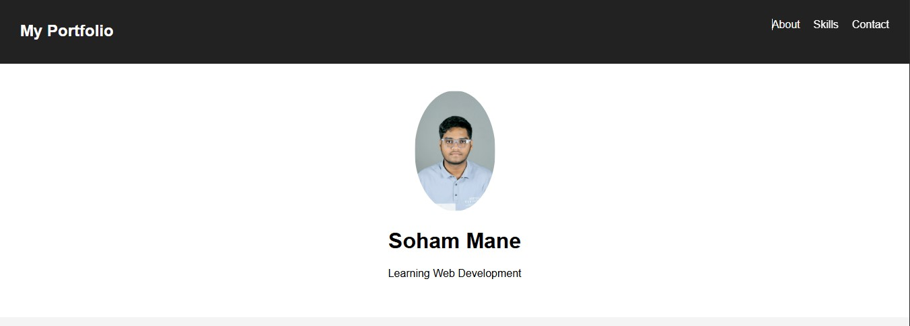
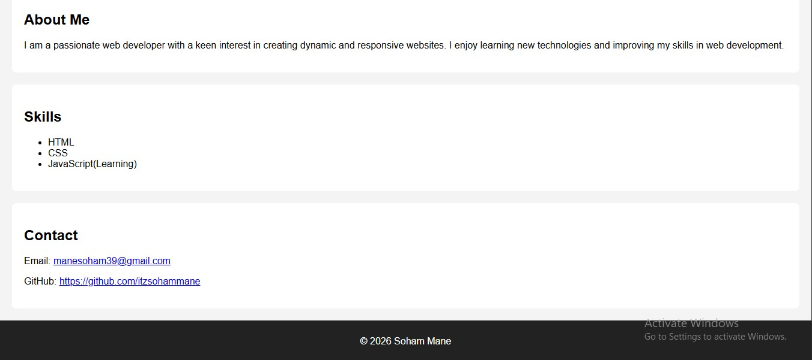

# 🌐 Personal Profile Webpage

This project is a simple yet well-structured personal profile webpage built using HTML and CSS. It is designed to showcase fundamental front-end development skills through a clean, responsive, and visually appealing layout.
 
## 🚀 Overview

The webpage presents essential personal information in an organized format, making it easy for visitors to understand the profile at a glance. It serves as a beginner-friendly project to demonstrate core web design principles and layout structuring.
 
 
## ✨ Features
<ul>
<li> 📄 Clean and minimal user interface.</li>
<li> 🧑 Personal information section.</li>
<li> 💡 Skills showcase.</li>
<li> 📞 Contact details section.</li>
<li> 🎨 Styled using pure CSS (no frameworks).</li>
</ul>
 
 
<h3>📷 Screenshots</h3> 
 
 

 
 
<h3>🛠️ Technologies Use</h3>
<ul>
<li> HTML5</li>
<li> CSS </li>
</ul>
 
 
<h3>🌐 Live Demo</h3>
 
https://itzsohammane.github.io/MyPortfolio/MyPortfolio.html
 
 
<h3>🎯 Purpose</h3>

This project is aimed at practicing and demonstrating:
<ul>
<li> Basic HTML structure and semantic elements.</li>
<li> CSS styling and layout design.</li>
<li> Creating a simple, user-friendly web interface.</li>
</ul>
 
<h3>📌 Use Case</h3>

Ideal for beginners who want to:
<ul>
<li> Build their first personal webpage.</li>
<li> Understand how HTML and CSS work together.</li>
<li> Create a portfolio base for future enhancements.</li>
</ul>
 
 
<h3>🔮 Future Enhancements</h3>
<ul>
<li> Add responsiveness for mobile devices.</li>
<li> Include animations and transitions.</li>
<li> Integrate JavaScript for interactivity.</li>
<li> Expand into a full portfolio website.</li>
</ul>
 
---
 
<h3> 💼 A solid first step toward building professional web development skills.</h3>
